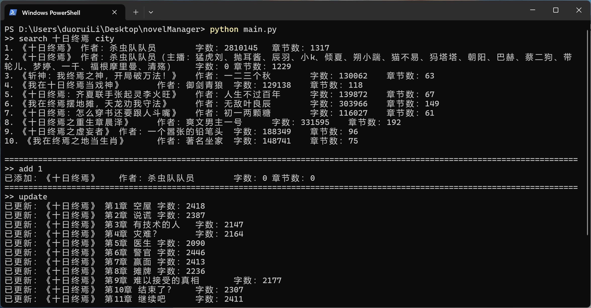
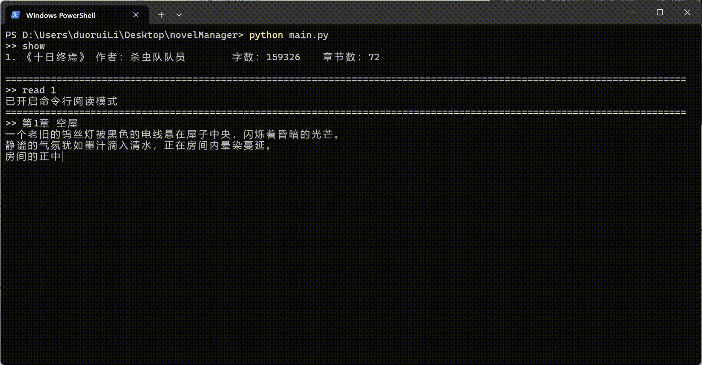

# novelManager
**书架管理、书籍下载、小说阅读**

## 一、项目概述
novelManager 是一款集成书架管理、书籍下载以及小说阅读功能的工具。

**特别鸣谢**：感谢 wqqxxx 对 1.4.0 版本 `main_tk.py` 的 contribute

## 二、环境要求与启动方式
1. **环境需求**
   - 需要安装 Python 3.10 版本。
   - 通过以下命令安装相关依赖：
   ```commandline
    pip install -r requirements.txt
    ```
2. **启动程序**
   - 命令行模式：`python main.py`
   - tkinterGUI 方案一 (contribute by wqqxxx)：`python main_tk.py`
   - tkinterGUI 方案二： `python main_GUI.py`

## 三、版本更新记录
<!--1.0版本-->
<details>
<summary>V 1.0 实现了基础功能</summary>

**版本 1.0.0（2024-10-5）**
- 实现书架管理及书城爬虫功能。
  - `shelf show`：显示书架中的所有书籍。
  - `shelf add`：支持将要添加的书籍文件（bookName.txt）放入`./data/import/`目录下进行添加，当`bookName=all`时，可将该目录下所有文件添加到书架。 
  - `shelf search`：用于书架内关键字查找。 
  - `shelf remove`：在使用`shelf search/show`后，可根据索引删除书架中的书籍。 
  - `city search`：通过爬虫在书城中搜索关键字。 
  - `city add`：将书城搜索结果序号对应的书籍添加到书架。 
  - `city update`：更新书架上所有从书城中添加的书籍，每更新 5 章会自动保存，可随时中断程序。 
  - `help`：查看指令帮助。 
  - `exit`：安全退出程序。
</details>

<!--1.1版本-->
<details>

<summary>V 1.1 更新了阅读功能</summary>

**版本 1.1.0（2024-10-6）**
- 更新阅读功能。
- 修复了书城爬虫无法爬到完整内容的 bug。 
- 新增`shelf export`：用于书籍导出。 
- 新增`shelf read`：用于阅读书籍。
</details>

<!--1.2版本-->
<details>
<summary>V 1.2 更新了网页阅读器功能</summary>

**版本 1.2.0（2024-10-7）**
- 新增网页阅读器相关功能。 
 - 新增`shelf hread`：使用网页阅读器阅读小说，可通过`help shelf hread`查看详细帮助。
**版本 1.2.1（2024-10-7）**
- 修复网页阅读器模板文件缺失的 bug。
**版本 1.2.2（2024-10-7）**
- 增强程序稳定性和功能完善。 
- 增加报错功能，解决程序异常退出的情况。 
- 修复了阅读器中的一些 bug。 
- 将搜索功能（`shelf search`，`city search`）修改为支持空格。 
- `shelf read`、`shelf hread`、`shelf remove`、`shelf export`现在支持搜索索引并将最匹配的结果作为输入。 
- 修复了`shelf add`会重复添加已添加过的书籍的 bug。
**版本 1.2.3（2024-10-7）**
- 修复阅读器相关 bug 和优化代码结构。
- 修复了`shelf hread`的`chapter`参数超出合法范围导致无法阅读的 bug。
- 调整了项目代码的结构。
</details>

<!--1.3版本-->
<details>
<summary>V 1.3 更新了设置功能</summary>

**版本 1.3.0（2024-10-8）**
- 新增设置功能和优化其他功能。
- 新增`set`指令，可修改默认阅读速度和是否自动清空命令行。
- 优化了结果输出格式。
- 修复了`city add`可重复添加已添加过的书籍的 bug。
- 将`shelf`下的部分二级指令改为一级指令，可通过`help`查看可用指令。
**版本 1.3.1（2024-10-9）**
- 在`set`指令中增加`hReadTemplate`项，用来更换html阅读器模板。
- 新增ai生成的html小说阅读器模板，使用`set hReadTemplate aiHreader`更换模板。
- 修复了书城爬虫对特殊字符 '\r' 的处理。
**版本 1.3.2（2024-10-10）**
- 添加了一些代码注释和文档。
- 修改了命令行阅读器保存进度的逻辑，现在执行`read`后按`esc`退出的同时保存进度。
</details>

<!--1.4版本-->
<details>
<summary>V 1.4 更新了GUI</summary>

**版本 1.4.0（2024-10-10）**
- 添加了tkinterGUI，使用`python main_tk.py`运行。
- 注意：tkinterGUI功能不完善！

**版本 1.4.1（2024-10-10）**
- 新增了`main_GUI.py`，运行`python main_GUI.py`可打开tkinterGUI
- 优化了书城爬虫的初始化逻辑，加快了程序启动速度。

**版本1.4.2（2024-10-11）**
- 优化了`main_GUI.py`界面和部分逻辑，舍弃了部分操作，简化了界面。
- GUI支持的操作：
  - 书架：书架搜索、删除、阅读、导入。
  - 书城：书城搜索、添加到书架、更新。

**版本1.4.3（2024-10-11）**
- 对GUI界面新增配色切换。

**版本1.4.4（2024-10-12）**
- 修改了 `./data/` 文件夹的定位方式，现在无论程序从哪里启动，都能正确的指向 `./data/` 文件夹。
- 简化了一些指令：
  - `shelf show` -> `show`
  - `shelf remove` -> `remove`
  - `shelf export` -> `export`
  - `city update` -> `update`

**版本1.4.5（2024-10-13）**
- 进一步简化了指令系统，移除了指令集结构，详情请使用`help`指令查询。
  - shelf add -> import
  - city add -> add
  - shelf search -> search
  - city search -> search
- 修改了部分设置的默认值。
- 增加了`open`指令，打开数据文件夹。

**版本1.4.6（2024-10-19）**
- 新增`content`指令，用于查看书籍目录。
- 对`remove`指令增加了确认环节，防止误删。

</details>

## 四、指令详细介绍
<details>
<summary>点击展开</summary>

- `add [index]`
  - 功能：将书城搜索结果序号对应的书籍添加到书架。
  - 参数说明：`index`为书城搜索结果的序号，也可以是文字，表示搜索并使用匹配度最高的结果。
- `content [index] [beg=1] [end=100]`
  - 功能查看书籍目录。
  - 参数说明：
    - `index`为书城搜索结果的序号，也可以是文字，表示搜索并使用匹配度最高的结果。
    - 目录范围为第`beg`章到`end`章。
- `exit`
  - 功能：安全退出程序。
- `export [index=None]`
  - 功能：导出书籍。
  - 参数说明：
    - 使用`shelf search`/`show`后，根据`index`导出对应书籍。
    - 当`index`非数字时，使用搜索到匹配程度最高的结果作为目标。
    - 当`index`为默认值时，导出全部书籍。
- `read [index] [chapter=None]`
  - 功能：阅读书籍。
  - 参数说明：
    - 使用`shelf search`/`show`后，根据`index`阅读对应书籍。
    - 当`index`非数字时，使用搜索到匹配程度最高的结果作为目标。
    - `chapter`：默认为当前阅读进度。
- `help [orderName=help]`
  - 功能：查看`orderName`指令的帮助，支持长指令如`help shelf search`。
- `hread [index] [chapter=None]`
  - 功能：使用网页阅读器阅读书籍。
  - 参数说明：
    - 使用`shelf search`/`show`后，根据`index`阅读对应书籍。
    - 当`index`非数字时，使用搜索到匹配程度最高的结果作为目标。
    - `chapter`：默认为当前阅读进度。
    - 网页阅读器的阅读进度单独存储，不与 novelManager 的阅读进度共享，但当 novelManager 阅读进度发生变化时，会自动同步到 novelManager 的进度。
    - 使用`hread`后将在`./data/export/`中产生`xx.html`文件，下次阅读时可直接打开该文件。
- `import [bookName=all] [author=匿名]`
  - 功能：将书籍文件导入到书架。 
  - 参数说明：
    - `bookName`：要添加的书籍文件名（需将文件放入`./data/import/`目录下），当`bookName=all`时，添加该目录下所有文件。
    - `author`：默认为匿名。 
- `open`
  - 功能：打开数据文件夹
- `remove [index]`
  - 功能：从书架中删除书籍。 
  - 参数说明：
    - 使用`shelf search`/`show`后，根据`index`删除对应书籍。
    - 当`index`非数字时，使用搜索到匹配程度最高的结果作为目标。
- `search [keywords] [scope=shelf]`
  - 功能：在书架或书城中进行关键字搜索。
  - 参数说明：`scope`可选值为`city` / `shelf`。
- `set [key] [value]`
  - 功能：修改默认设置。
  - 参数说明：
    - `key`：设置项，包括以下内容：
      - `readSpeed`（命令行阅读器阅读速度，单位为字 / 秒）
      - `autoCls`（是否开启命令行自动刷新，0 为关闭，1 为开启）。
      - `hReadTemplate`: html阅读器模板，输入`./html/`文件夹下的文件名
      - `color`: `main_GUI`的配色方案，可选0~3，分别对应活力橙, 暗夜黑, 经典白, 靛紫青
    - `value`：对应设置项的值。
- `show`
  - 功能：显示书架中的所有书籍。
- `update`
  - 功能：更新书架上所有从书城中添加的书籍。
  - 说明：每更新 5 章会自动保存，可以随时中断程序。

</details>

## 五、命令行阅读器操作说明
使用`read`指令进入阅读状态后，可使用以下快捷键进行操作： 
1. `+/-`键：控制阅读速度。
2. 方向`←/→`键：切换到上（下）一章。
3. 方向`↓`键：快进 5 秒。
4. 空格键：暂停 / 开始阅读。
5. `esc`键：退出阅读模式。

## 六、使用示例
**1. 从书城下载书籍**
```commandline
# 在书城中搜索《十日终焉》
search 十日终焉 city
# 将搜索到的第一个结果添加到书架
add 1
# 更新书架中所有来自书城的小说
update
# 每更新五章会自动保存，更新过程中可以随时关闭程序
```


**2. 查看书架并阅读书架中的书籍**
```commandline
# 查看书架所有书籍
show
# 使用命令行阅读器，阅读十日终焉
read 1
# 按esc键退出阅读模式
# 使用html阅读器，阅读十日终焉
hread 十日终焉  # 除了直接输入索引值，也可以输入书名，自动搜索并使用匹配程度最高的结果
```



**3. 书籍导出**
```commandline
export 十日终焉
# 查看./data/export/文件夹，发现刚刚导出的文件十日终焉.txt
```

**4. 书架删除**
```commandline
remove 十日终焉
```

**5. 从文件中导入书籍**
```commandline
# 将xx.txt书籍文件放入./data/import/文件夹
import  # 导入./data/import/文件夹下的所有书籍文件
import 十日终焉  # 导入十日终焉.txt
```
