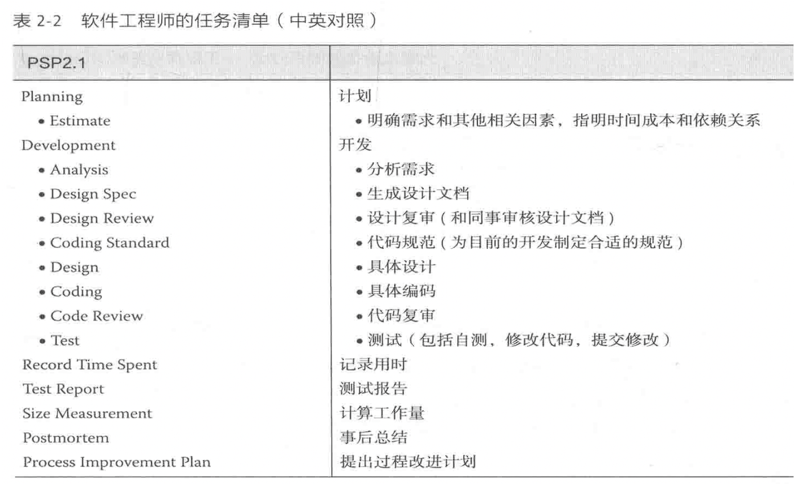

## 计划
**需求：**
- 书架管理
  - 添加书籍（书名、作者、字数等）
  - 删除书籍
  - 搜索书籍
  - 支持导出为微信读书兼容的格式
- 书城爬虫
  - 在线搜索，显示书名、作者、字数
  - 添加到书架
- 小说阅读器
  - 命令行阅读
  - 快捷键操控
  - 实时保存阅读进度

**时间成本：** 两天

**依赖关系：** Python

## 开发

**指令需求** （后续如有更多的需求可拓展）
- shelf
  - `shelf show`
    - 显示书架中的所有书籍
  - `shelf add [bookName]`
    - 将要添加的书籍文件（bookName.txt）放入./data/import/目录下，执行命令后可添加到书架
  - `shelf search [keywords]`
    - 书架内关键字查找
  - `shelf remove [index]`
    - 删除shelf show或shelf search的结果index对应的书籍
- city
  - `city search [keywords]`
    - 通过爬虫在书城中搜索关键字
  - `city add [index]`
    - 将city search的搜索结果的index项添加到书架中
  - `city update`
    - 更新书架上所有从书城中添加的书籍
    - 每更新5章会自动保存，可以随时中断程序
- `help [order=None]`
  - 查看order指令的帮助，支持长指令如`help shelf show`
- `exit`
  - 退出

**具体设计：**
- **模块编写**
  - 命令解析（预计2h）
    - 将命令及参数传给对应的函数进行处理
    - 使用函数修饰器将命令与函数绑定
    - 提供帮助文档
  - 文件管理（预计2h）
    - 管理必要的数据文件（.json）
    - 书架信息、书籍信息等
  - 书架管理（预计2h）
    - 查看、添加、删除、查找
  - 书城爬虫（预计2h）
    - 搜索、下载、更新
- **模块组装**
  - 使用命令解析注册指令，调用各个模块的接口实现预期功能（预计5h）
- **后续**
  - 测试（预计5h）
  - bug修复（预计5h）
  - 功能拓展（预计8h）

**代码规范：** 爬虫模块`src/bug.py`及操作捕获模块`src/record.py`用到之前写的库，使用下划线命名规则；其他部分变量命名使用驼峰规则，使用规范化的排版和注释。

## 记录用时
需求分析等前期工作2h左右，之后两天左右实现基本功能，后续进行更多测试和功能拓展

## 测试报告
- 输入指令时，使用错误的语法会导致程序异常中断（已修复）
- 当添加了空书籍时，使用阅读器会报错（已修复）
- 每次阅读时，需要先使用shelf show或shelf search拉取书籍列表，比较麻烦（已改进）
- shelf add 指令会重复添加已添加过的书籍（已修复）
- shelf hread 的chapter参数超出合法范围会跳出空白页面（已修复）

## 计算工作量
总体代码量超过三千行，其中一千行为wqqxxx贡献。

## 事后总结
在开发时充分考虑了用户的使用体验，对一些原本比较复杂的命令做了简化（见README.md文件更新记录），并开发了GUI界面，使用起来体验很好。

类的封装很好，注释和文档也比较清楚，后续进行功能拓展时很方便。

## 提出过程改进计划
指令最初设计的比较复杂，导致后续做简化的时候费了一番功夫，应该在设计之初就把用户使用体验考虑进去。
